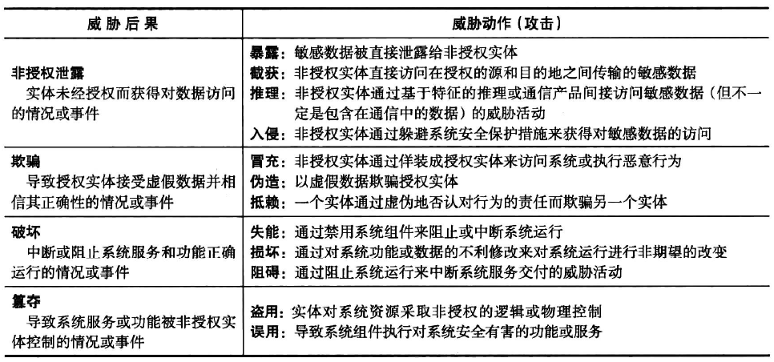

# 章节组成

| 概述                | 概述         |
| -----------------  | ------------ |
| 计算机安全技术与原理  | 第2章至第9章   |
| 软件和系统安全       | 第10章至第13章 |
| 管理问题            | 第14章至第19章 |
| 密码编码算法         | 第20章至第21章 |
| 网络安全            | 第22章至第24章 |

# 第1章 概述

## 1.1 计算机安全的概念

### 1.1.1 计算机安全的定义

NIST 计算机安全手册对计算机安全 (computer security) 的定义如下：

这个定义包括处于计算机安全核心地位的三个关键目标：

1. 机密性（confidentiality）：这个术语包含两个相关概念：
    - 数据机密性：确保隐私或机密信息不被非授权的个人利用，或被泄露给非授权的个人。
    - 隐私性：确保个人能够控制或影响与自身相关的信息的收集和存储，也能够控制这些信息可以由谁或向谁披露。
2. 完整性（integrity）：这个术语包含两个相关概念：
    - 数据完整性：确保信息和程序只能在指定的和被授权的情况下才能够被改变。
    - 系统完整性：确保系统在未受损的方式下执行预期的功能，避免对系统进行有意或无意的非授权操作。
3. 可用性（availability）：确保系统能够及时响应，并且不能拒绝授权用户的服务请求。

以上被称为**CIA三元组**，在众多的计算机系统安全分析中被使用。FIPS 199给出了CIA安全缺失的定义：

1. 机密性：非授权的信息披露。
2. 完整性：非授权的信息修改或破坏。
3. 可用性：对信息和信息系统的访问和使用的破坏。

此外部分计算机系统还增加了如下两个定义来更加全面和完整地描述计算机安全：

1. 真实性 (authenticity):真实性是一种能够被验证和信任的表示真实情况或正确程度的属性,它使得传输、消息和消息源的有效性能够被充分相信。这就意味着要验证用户的身份是否与其所声称的一致,并需要保证到达系统的每一个输人都是来自可信的信息源。

2. 可说明性 (accountability):安全目标要求实体的动作能够被唯一地追踪。这需要支持抗抵赖 (non-repudiation)、壁垒 (deterrence)、故障隔离、入侵检测和防护,以及事后恢复和诉讼 (legal action)。由于真正安全的系统目前还是不能达到的目标,因此,我们必须能够通过追踪来找到违反安全要求的责任人。系统能够留他们的活动记录,允许事后的取证分析用以跟踪安全违规或者为处理纠纷提供帮助。

### 1.1.2 实例

存在安全违规的机构或个人根据其所造成的影响分级：

- 低级：有限的负面影响
- 中级：严重的负面影响
- 高级：非常严重或者灾难性的负面影响

### 1.1.3 计算机安全面临的挑战

1. 计算机安全问题并不像初学者想象的那样简单。
2. 在开发某种安全机制或算法时，我们必须始终考虑对这些安全特征的潜在攻击。
3. 用于提供特定服务的程序，通常是与直觉相反的。
4. 对于已经设计出的各种安全机制，决定其适用场合是非常必要的。
5. 安全机制通常包含不止一种算法和协议。
6. 从本质上讲,计算机安全就是利用安全脆弱性进行破坏的攻击者和尽力阻止攻击的设计者或管理者之间的一场智力的较量。对于攻击者,主要优势在于他只需要找到一个安全脆弱性或漏洞即可;而管理者必须找到且消除所有的安全弱点才能得到真正的安全。
7. 对于部分用户和系统管理者来说，有这样一种自然的倾向：在安全保障失效之前，很少能够看到安全投入所带来的好处。
8. 安全要求定期甚至持续地对系统进行监视，但是在目前注重时效、超负荷运转的系统环境中很难做到这一点。
9. 安全性通常还是事后考虑的问题-在系统设计完成后才加入系统，而没有作为设计过程中的一个有机组成部分来看待。
10. 许多用户乃至安全管理者认为，坚固的安全性有碍于信息系统或信息使用的高效性和用户操作的友好性。

### 1.1.4 一个计算机安全模型

计算机系统资产：

- 硬件
- 软件
- 数据
- 通信设施和网络

计算机系统或者网络系统可能的脆弱性分类：

- 被恶意破坏
- 被泄漏
- 变得不可用

攻击分类：

根据攻击方法：

- 主动攻击
- 被动攻击

根据攻击位置：

- 内部攻击
- 外部攻击

## 1.2 威胁、攻击和资产

### 1.2.1 威胁与攻击

### 1.2.2 威胁与资产

#### 硬件

#### 软件

#### 数据

#### 通信线路和网络

## 1.3 安全功能要求

FIPS 200定义

## 1.4 基本安全设计原则

### 经济机制原则

### 安全缺省原则

### 绝对中介原则

### 开放式设计原则

### 特权分离原则

### 最小特权原则

### 最小共用机制原则

### 心理可接受性原则

### 隔离原则

### 封装原则

### 模块化原则

### 分层原则

### 最小惊动原则

## 1.5 攻击面和攻击树

### 1.5.1 攻击面

### 1.5.2 攻击树

## 1.6 计算机安全策略

### 1.6.1 安全策略

- 需要保护的资产的价值
- 系统的脆弱性
- 潜在的威胁和可能的攻击
- 易用性与安全
- 安全成本与失效-恢复成本

### 1.6.2 安全措施

- 预防
- 检测
- 响应
- 恢复

### 1.6.3 保证和评估

# 第2章 密码编码工具

## 2.1 用对称加密实现机密性

### 2.1.1 对称加密

### 2.1.2 对称分组加密算法

- DES
- 3DES
- AES

密码本模式

### 2.1.3 流密码

## 2.2 消息认证和散列函数

### 2.2.1 利用消息加密实现认证

### 2.2.2 无需加密的消息认证

#### 消息认证码（MAC）

如果接收到的认证码和计算出的认证码相等则：

1. 接收方可以相信消息未被修改。
2. 接收方可以相信消息来自真正的发送方。
3. 如果消息中含有序号，那么接收方可以相信消息顺序是正确的。

#### 单向散列函数

与MAC不同，生成散列函数的过程不使用秘密密钥作为输入。

### 2.2.3 安全散列函数

## 2.2 公钥加密
