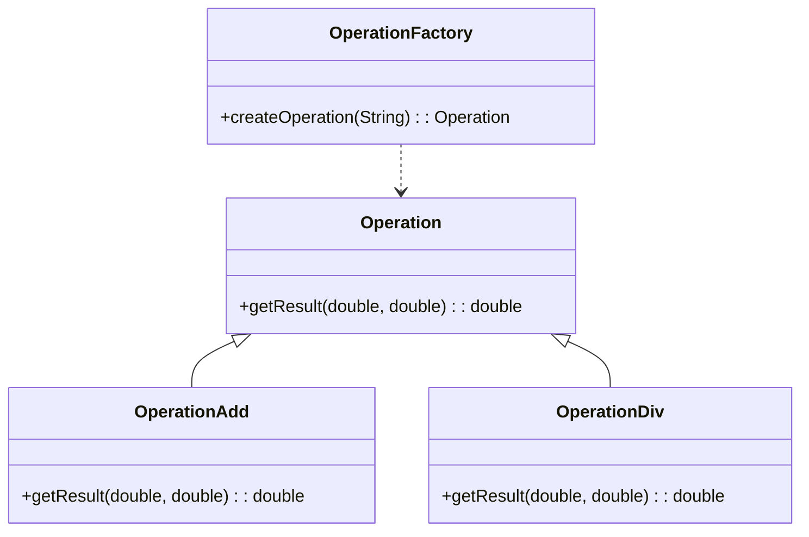
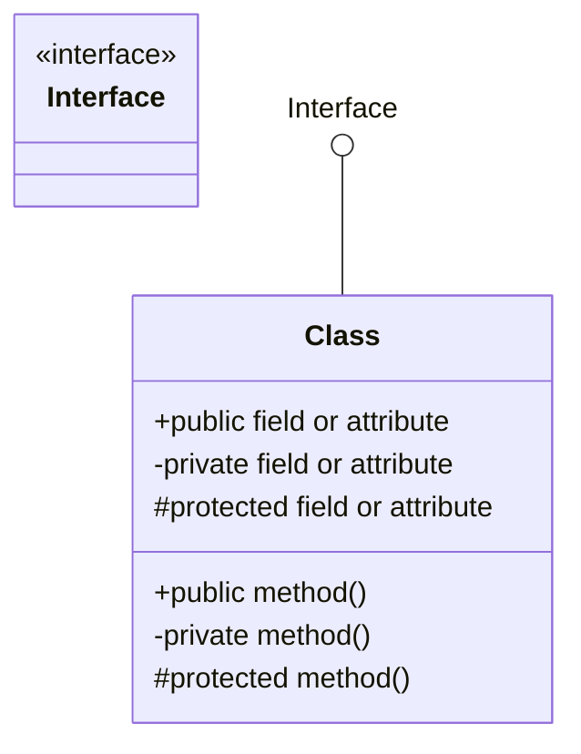
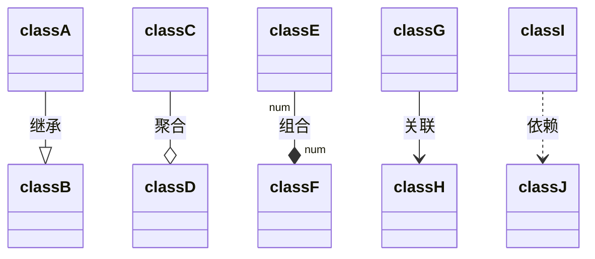
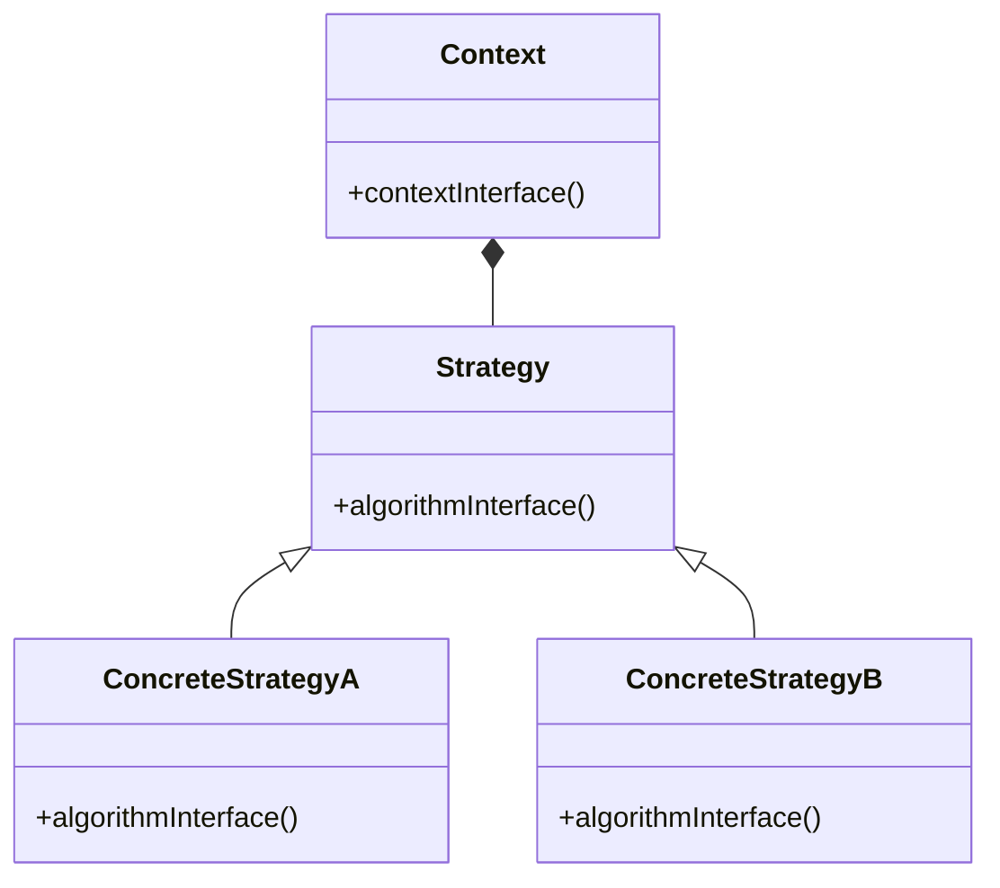

# 大话设计模式

## 1. 简单工厂模式

### 1.3 代码规范

### 1.4 面向对象编程

优点:

- 可维护
- 可扩展
- 可复用
- 灵活度高

特性:

- 封装
- 继承
- 多态

### 1.9 紧耦合 VS. 松耦合

```java
public abstract class Operation {
    double getResult(double numberA, double numberB);
}

public class OperationAdd extends Operation {
    public double getResult(double numberA, double numberB) {
        return numberA + numberB;
    }
}
...
public class OperationDiv extends Operation {
    public double getResult(double numberA, double numberB) {
        if (numberB == 0) {
            throw new RuntimeException("除数不能为0");
        }
        return numberA / numberB;
    }
}
```

### 1.10 简单工厂模式

```java
public class OperationFactory {
    public static Operation createOperation(String operate) {
        Operation operation = null;
        switch (operate) {
            case "+":
                operation = new OperationAdd();
                break;
            case "-":
                operation = new OperationSub();
                break;
            case "*":
                operation = new OperationMul();
                break;
            case "/":
                operation = new OperationDiv();
                break;
        }
        return operation;
    }
}
```

客户端代码:

```java
Operation oper = OperationFactory.createOperation(operateStr);
double res = oper.getResult(numberA, numberB);
```

结构图:



### 1.11 UML 类图

UML 类图的说明如下:



UML 下为类定义了八种不同类型的关系

| 类型  |    描述     |
| :---: | :---------: |
| <\|-- |    继承     |
|  *--  |    作品     |
|  o--  |    聚合     |
|  -->  |    关联     |
|  --   | 链接 (实心) |
|  ..>  |    依赖     |
| ..\|> |    实现     |
|  ..   | 链接 (虚线) |



## 2. 策略模式

### 2.4 策略模式

> 策略模式 (Strategy Pattern) 定义了一系列算法, 并将每一个算法封装起来, 使它们可以相互替换, 且算法的变化不会影响使用算法的客户.

框架图



代码

```java
public class Strategy {
    public abstract void algorithmInterface();
}

public class ConcreteStrategyA extends Strategy {
    public void algorithmInterface() {
        System.out.println("算法 A 实现");
    }
}
...
public class Context {
    private Strategy strategy;
    public Context(Strategy strategy) {
        this.strategy = strategy;
    }
    public void contextInterface() {
        strategy.algorithmInterface();
    }
}
```

### 2.5 策略模式实现

### 2.6 策略与简单工厂结合

```java
public class CashContext {
    private CashSuper cs;
    public CashContext(String type) {
        switch (type) {
            case 1:
                cs = new CashNormal();
                break;
            case 2:
                cs = new CashReturn(300d, 100d);
                break;
            case 3:
                cs = new CashRebate(0.8d);
                break;
        }
    }
    public double getResult(double price, int num) {
        return cs.acceptCash(price, num);
    }
}
```

### 2.7 策略模式解析

- 减少各种算法类和使用算法类之间的耦合
- 有助于析取出算法的公共部分, 便于维护
- 简化单元测试
